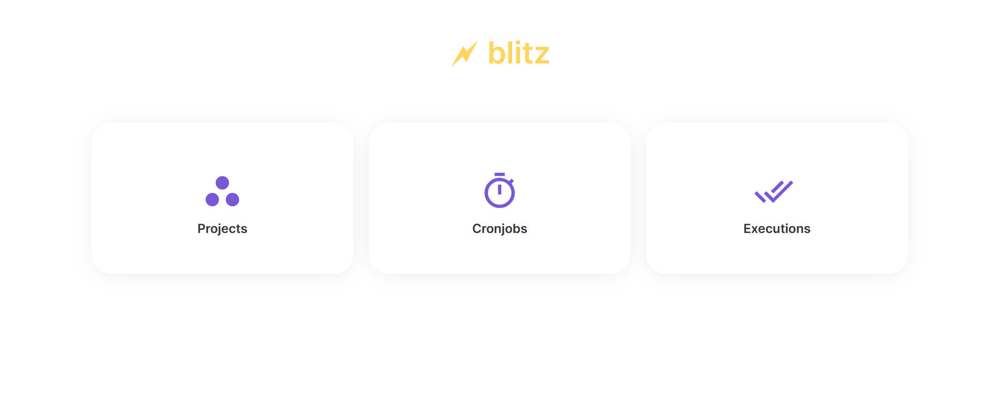
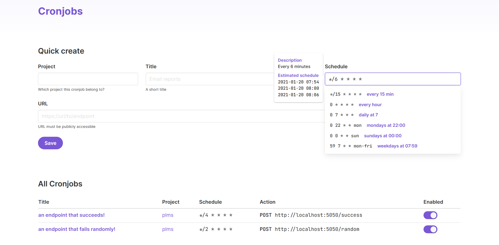
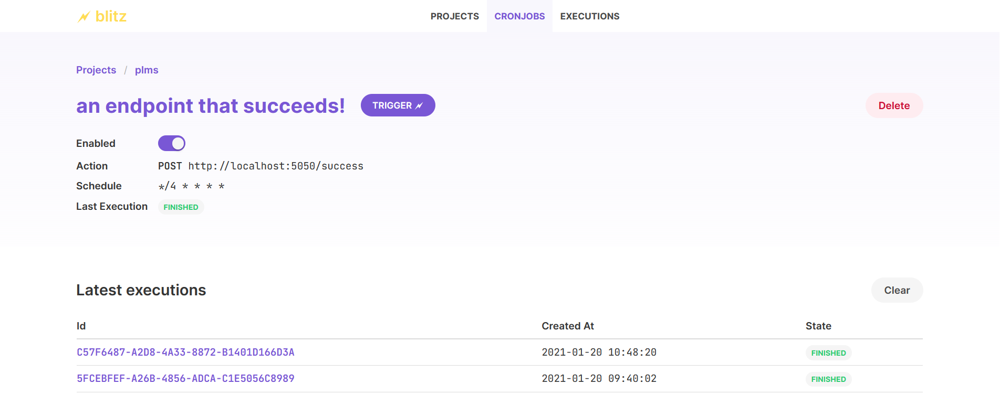
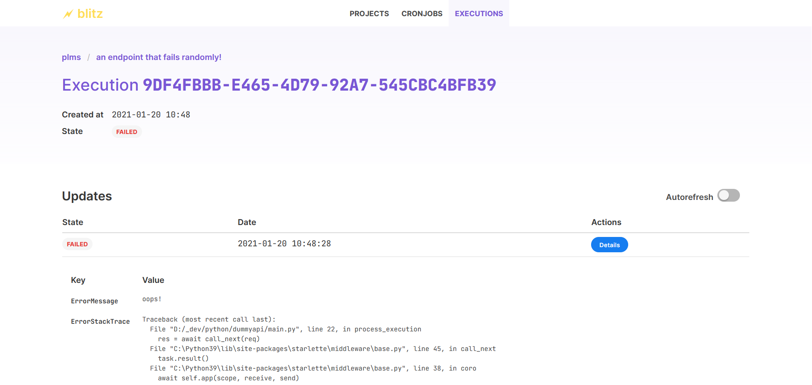

# 🗲 blitz

A crontab-as-a-service that sends requests to URLs at the given schedule.

## How it works

- You create a cronjob to send a GET/POST request to a URL at some cron schedule.
- Blitz sends a request to that URL, passing an `X-Execution-Id` header.
- The app can then send a request to `/api/executions/$executionId/status` to update if it's completed/failed, optionally with a JSON for
  including some details.

## Features

- Create cronjobs that trigger a URL
- Group cronjobs in projects
- See the recent executions of a cronjob
- Manually trigger a cronjob
- Garbage collector for deleting old executions

## Screenshots

- Cronjob creation screen and list of available cronjobs
  
- Detail screen with recent executions
  
- An execution and updates to it
  